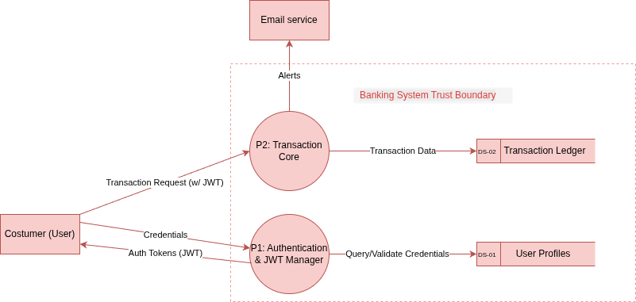

# THREAT MODELING REPORT: ONLINE BANKING SYSTEM

  
   
  <strong>Escuela Colombiana de Ingeniería Julio Garavito</strong>
   
   
  <strong>Project:</strong> Lab 04 - Threat Modeling   
  <strong>Subject:</strong> IT Security and Privacity   
  <strong>Professor:</strong> Daniel Esteban Vela López   
  <strong>Authors:</strong> Andersson David Sánchez Méndez & Cristian Santiago Pedraza Rodríguez   
  <strong>Date:</strong> 2026-02-17   
  <strong>Location:</strong> Bogotá, Colombia    
  <strong>Confidentiality:</strong> Internal / Academic Use Only

---

## 1. PART 1: CASE INTRODUCTION AND ASSET ANALYSIS

### 1.1 Objective
The objective of this phase is to answer the question **"What are we working on?"**. By decomposing the Online Banking Web Application, we establish the boundaries of our security analysis and identify the high-value targets (Assets) and entry points that define the system's attack surface.

### 1.2 System Decomposition

#### **Critical Assets**
We have identified the following assets as the core of the system’s value and functionality:

| Asset ID | Asset Name | Description | Sensitivity |
| :--- | :--- | :--- | :--- |
| **A-01** | User Credentials | Hashed passwords, usernames, and 2FA secrets. | **Critical** |
| **A-02** | Session Tokens | JWTs generated after successful authentication. | **High** |
| **A-03** | Financial Data | Account balances and real-time transaction records. | **Critical** |
| **A-04** | PII | Names, addresses, emails, and phone numbers. | **High** |
| **A-05** | Banking APIs | Logic and endpoints facilitating all transfers and queries. | **High** |

#### **Actors and Entry Points**
To map how threats can reach our assets, we define who interacts with the system and through which interfaces:

* **Actors:**
    * **Customer:** Standard user performing banking operations via browser.
    * **Bank Admin:** Internal staff with privileged access to manage accounts.
    * **External Payment Processor:** Third-party API for interbank transfers.
    * **Attacker:** External hackers or malicious internal staff (insider threats).

* **Entry Points (EP):**
    * **EP-01:** Customer Web Login Page (Frontend).
    * **EP-02:** Backend API REST Endpoints (Internal/External calls).
    * **EP-03:** Admin Portal Authentication Page.
    * **EP-04:** Email Notification Ingress (Interaction with links/alerts).

### 1.3 Data Flow Diagram (DFD) - Level 1
*The DFD illustrates the interaction between external entities, core processes, and data stores, following the logic required for the STRIDE analysis.*

**Diagram Components:**
1. **External Entities:** Customer (User) and Email Service (Notification output).
2. **Processes:** * **P1: Authentication & JWT Manager:** Validates user identity. * **P2: Transaction Core:** Processes transfers and queries ledger. 
3. **Data Stores:** * **DS-01 User Profiles:** Encrypted credentials and PII. * **DS-02 Transaction Ledger:** Financial history and balances.
4. **Data Flows:** Directional arrows indicating "Credentials", "Auth Tokens", "Transaction Data", and "Alerts".

---

## 2. PART 2: APPLYING STRIDE TO THE DFD

### 2.1 Threat Categorization and Analysis
Following the STRIDE methodology, we systematically analyzed each component and data flow of our Online Banking System. This phase identifies potential design flaws and attack vectors that could impact the system's security pillars.

| DFD Element | STRIDE Type | Threat Description | Proposed Countermeasure |
| :--- | :--- | :--- | :--- |
| **Login Web Page (EP-01)** | **S**poofing | An attacker uses credential stuffing or phishing to impersonate a customer. | Implement Multi-Factor Authentication (MFA) and rate-limiting on login attempts. |
| **User Profile DB (DS-01)** | **T**ampering | A malicious insider modifies account roles or 2FA secrets directly in the database. | Database encryption at rest and strict row-level access control with auditing. |
| **Email Service (P3)** | **R**epudiation | A user claims they never received or authorized a transfer alert to commit fraud. | Digitally signed logs for every sent notification and delivery status tracking. |
| **Backend API (P1/P2)** | **I**nformation Disclosure | Error messages or API responses leak JWT secret keys or internal server paths. | Custom error handling (masking internal errors) and TLS 1.3 for data in transit. |
| **Transaction Core (P2)** | **D**enial of Service | An attacker floods the transfer endpoint with requests to crash the banking ledger. | Implement API Gateway throttling, Web Application Firewall (WAF), and load balancing. |
| **Admin Portal (EP-03)** | **E**levation of Privilege | A standard customer accesses the `/admin` path by manipulating session token claims. | Robust Role-Based Access Control (RBAC) and server-side validation of JWT claims. |

### 2.2 Detailed Threat Narrative: SQL Injection on Financial Ledger
**Element affected:** Transaction Ledger (DS-02) via Backend API (P2).
**STRIDE Category:** Tampering / Information Disclosure.

The transaction manager (P2) interacts with the Ledger Database (DS-02) to query balances and record transfers. If the input parameters (e.g., `account_id`) are not properly sanitized, an attacker could execute an **In-band SQL Injection**. 

* **Potential Impact:** An attacker could modify their own account balance (Tampering) or dump the entire transaction history of other bank users (Information Disclosure). 
* **Selected Countermeasure:** Use of **Parameterized Queries (Prepared Statements)** and a database user with the "Least Privilege" principle (cannot drop tables or access system schemas).

---

## 3. PART 3: RISK ANALYSIS WITH DREAD

### 3.1 Prioritization Matrix
To define "What are we going to do about it?", we use the **DREAD** formula to rank threats. Each criterion is scored from 1 to 10, where the total risk is the average:
$$\text{Total Risk} = \frac{(D + R + E + A + D)}{5}$$

| Threat | Damage | Repro | Exploit | Affected | Discov | **Total Risk** |
| :--- | :---: | :---: | :---: | :---: | :---: | :---: |
| **SQL Injection (DS-02)** | 10 | 8 | 7 | 10 | 7 | **8.4 (Critical)** |
| **Credential Spoofing (EP-01)** | 9 | 9 | 8 | 9 | 7 | **8.4 (High)** |
| **DoS on API (P2)** | 7 | 10 | 10 | 10 | 8 | **9.0 (Critical)** |

### 3.2 Mitigation Discussion and Prioritization
Based on the scores, we have prioritized the following actions:

1.  **DoS on API (Total 9.0):** Although it doesn't steal data, it has the highest score due to its ease of execution (Exploitability 10) and impact on all users (Affected 10). A successful DoS would paralyze the bank's operations immediately.
2.  **SQL Injection (Total 8.4):** Ranked as **Critical** because it threatens the **Integrity** (Damage 10) of the financial ledger. Even though it is slightly harder to discover than a DoS, its impact on the bank's core assets is devastating.
3.  **Credential Spoofing (Total 8.4):** While it shares a high score, it is considered the third priority because it often targets individual accounts rather than the entire database structure at once. However, the implementation of **MFA** is the primary recommendation to mitigate this risk.
 
 
---
 
 

## 4. TEST YOURSELF (KNOWLEDGE VERIFICATION)

### 4.1 STRIDE: E-commerce Scenario
*For an e-commerce system, we identified the following threats for each category:*

* **Spoofing:** An attacker impersonates a customer using stolen session cookies to hijack a shopping cart.
* **Tampering:** A user modifies the "price" hidden field in the HTTP POST request of the shopping cart to purchase items for $0.01.
* **Repudiation:** A customer makes a high-value purchase and later claims they never authorized the transaction because the system lacks digital signatures for order confirmation.
* **Information Disclosure:** The payment gateway logs full credit card numbers in plain text within the server's debug logs.
* **Denial of Service:** An attacker sends thousands of "Add to Cart" requests per second, exhausting the database connection pool.
* **Elevation of Privilege:** A regular customer changes the `user_id` in the profile URL (IDOR) to access the admin dashboard and view all platform sales.

### 4.2 DREAD: SQL Injection Case Study
*Evaluating a SQL Injection vulnerability in a login form:*

| Criterion | Score | Justification |
| :--- | :---: | :--- |
| **Damage** | 10 | Can lead to a full database dump, including PII and credentials. |
| **Reproducibility** | 10 | The exploit works 100% of the time as long as the code remains unpatched. |
| **Exploitability** | 9 | Numerous automated tools (like sqlmap) can exploit this with minimal skill. |
| **Affected Users** | 10 | Every user in the database is at risk of credential theft. |
| **Discoverability** | 8 | Easily found by simple manual testing (adding a single quote `'`) or scanners. |
| **Total Risk** | **9.4** | **Critical:** This represents an immediate threat to organizational survival. |

 
 
### 4.3 Design vs. Production Costs: The "Shift Left" Principle
It is more cost-effective to apply threat modeling during the **design phase** because fixing a vulnerability in production requires not only a code change but also regression testing, potential downtime, emergency deployments, and—in worst-case scenarios—paying for legal fines or brand recovery after a breach. Fixing a logic flaw on a whiteboard costs minutes of discussion; fixing it in production can cost thousands of dollars and hundreds of man-hours.

---

## 5. CONCLUSIONS & REFLECTIONS

**Andersson David Sánchez Méndez:**
"This laboratory demonstrated that security is not just about running tools like Nmap (from Lab 03), but about architectural thinking. By asking 'What can go wrong?' early on, we identified that internal threats to the database are just as dangerous as external hackers. Learning to quantify risk with DREAD allows us to stop guessing and start prioritizing based on actual business impact."

**Cristian Santiago Pedraza Rodríguez:**
"The most significant takeaway for me was the power of the Data Flow Diagram (DFD). It transformed a complex system into a manageable map where we could see exactly where data is most vulnerable. Threat modeling changes the developer's mindset from 'how do I build this?' to 'how could this be broken?', which is essential for building resilient financial systems."

---

## 6. REFERENCES
- **OWASP:** Threat Modeling Process. https://owasp.org/www-community/Threat_Modeling
- **Microsoft Learn:** STRIDE Threat Model. https://learn.microsoft.com/en-us/previous-versions/azure-security-develop-threat-modeling-tool-threats
- **NIST SP 800-154:** Guide to Data-Centric System Threat Modeling.

---